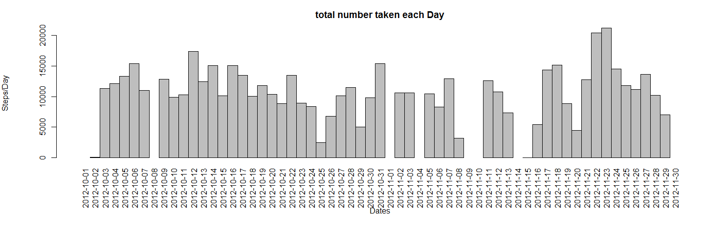
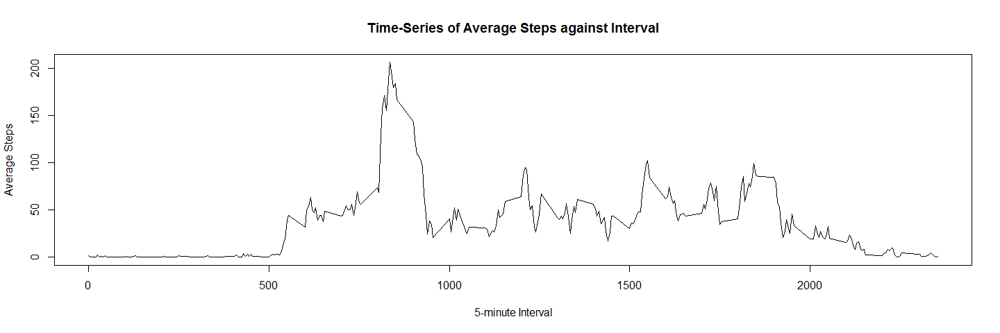
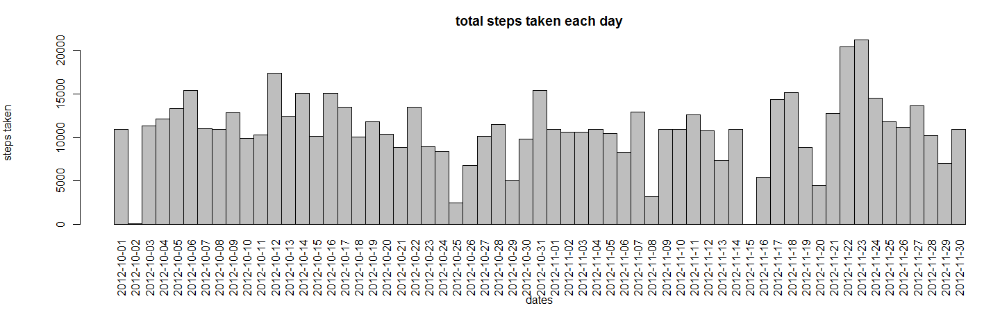

# 2nd Week Reproducible Research Project

#Loading and preprocessing the data
### 1) Load the data

The data for this assignment was downloaded from the course web site:
<https://d396qusza40orc.cloudfront.net/repdata%2Fdata%2Factivity.zip>


```r
getdata = function()
{
   if (!file.exists("activity.csv"))
   {
      # download the data
      fileURL <- "https://d396qusza40orc.cloudfront.net/repdata%2Fdata%2Factivity.zip"
      download.file(fileURL, "boogie.zip")
      unzip("boogie.zip")
   }
}
```
### 2) Process/transform the data (if necessary) into a format suitable for your analysis

```r
data <- read.csv("activity.csv")
```
#What is mean total number of steps taken per day?
### 1) Calculate the total number of steps taken per day

```r
steps <- aggregate(data$steps, list(data$date), sum)
colnames(steps) <- c("Date", "Steps")
```
### 2) Make a histogram of the total number of steps taken each day

```r
with(steps, { 
    par(oma=c(2,0,0,0), mar=c(6,6,3,0), mgp=c(5,1,0), las=3)
    barplot(
      height= Steps,
      main="total number taken each Day", xlab="Dates", ylab="Steps/Day",
      names.arg=Date, space=c(0)
    )
  })
```

 
### 3) Calculate and report the mean and median of the total number of steps taken per day

####Mean:

```r
dailyMean <- mean(steps$Steps, na.rm = TRUE)
```

```
## [1] 10766.19
```
####Median:

```r
dailyMedian <- median(steps$Steps, na.rm = TRUE)
```

```
## [1] 10765
```
  
#What is the average daily activity pattern?
### 1) Make a time series plot (i.e. type = "l") of the 5-minute interval (x-axis) and the average number of steps taken, averaged across all days (y-axis)

```r
intervalPeriod <- aggregate(
  data=data, steps~interval, FUN=mean, na.action=na.omit
)
colnames(intervalPeriod) <- c("Interval", "avgSteps")
```

Top portion of the data:

```
##    Interval  avgSteps
## 1         0 1.7169811
## 2         5 0.3396226
## 3        10 0.1320755
## 4        15 0.1509434
## 5        20 0.0754717
## 6        25 2.0943396
## 7        30 0.5283019
## 8        35 0.8679245
## 9        40 0.0000000
## 10       45 1.4716981
## 11       50 0.3018868
## 12       55 0.1320755
## 13      100 0.3207547
## 14      105 0.6792453
## 15      110 0.1509434
```

### 2) Which 5-minute interval, on average across all the days in the dataset, contains the maximum number of steps?

```r
with(intervalPeriod, {
     plot(
        x=Interval, y=avgSteps,
        type="l", main="Time-Series of Average Steps against Interval",
        xlab="5-minute Interval", ylab="Average Steps"
        
     )
  })
```

 

####The 5-minute interval that, on average, contains the maximum number of steps


```r
intervalMax <- intervalPeriod[intervalPeriod$avgSteps==max(intervalPeriod$avgSteps),]
```

```
##     Interval avgSteps
## 104      835 206.1698
```
  
#Imputing missing values
### 1) The total number of missing values in the dataset (i.e. the total number of rows with NAs)

```r
NumberOfNA <- nrow(subset(data, is.na(data$steps)))
```

```
## [1] 2304
```
### 2) A strategy for filling in all of the missing values in the dataset.

```r
stepValues <- data.frame(data$steps)
stepValues[is.na(stepValues),] <- ceiling(tapply(X=data$steps,INDEX=data$interval,FUN=mean,na.rm=TRUE))
newData <- cbind(stepValues, data[,2:3])
colnames(newData) <- c("Steps", "Date", "Interval")
```

```
##    Steps       Date Interval
## 1      2 2012-10-01        0
## 2      1 2012-10-01        5
## 3      1 2012-10-01       10
## 4      1 2012-10-01       15
## 5      1 2012-10-01       20
## 6      3 2012-10-01       25
## 7      1 2012-10-01       30
## 8      1 2012-10-01       35
## 9      0 2012-10-01       40
## 10     2 2012-10-01       45
## 11     1 2012-10-01       50
## 12     1 2012-10-01       55
## 13     1 2012-10-01      100
## 14     1 2012-10-01      105
## 15     1 2012-10-01      110
```
### 3) Create a new dataset that is equal to the original dataset but with the missing data filled in.

```r
newData2 <- aggregate(newData$Steps, list(newData$Date), sum)
colnames(newData2) <- c("Date", "Steps")
```

```r
print(newData2[1:15,])
```

```
##          Date Steps
## 1  2012-10-01 10909
## 2  2012-10-02   126
## 3  2012-10-03 11352
## 4  2012-10-04 12116
## 5  2012-10-05 13294
## 6  2012-10-06 15420
## 7  2012-10-07 11015
## 8  2012-10-08 10909
## 9  2012-10-09 12811
## 10 2012-10-10  9900
## 11 2012-10-11 10304
## 12 2012-10-12 17382
## 13 2012-10-13 12426
## 14 2012-10-14 15098
## 15 2012-10-15 10139
```

### 4) Make a histogram of the total number of steps taken each day and Calculate and report the mean and median total number of steps taken per day.


```r
with(newData2, {
  par(oma=c(2,0,0,0), mar=c(6,6,3,0), mgp=c(5,1,0), las=3)
  barplot(
    height=Steps,
    main="total steps taken each day",
    xlab="dates", ylab="steps taken",
    names.arg=Date, space=c(0)
  )
})
```

 

```r
newDailyMean <- mean(newData2$Steps)
print(newDailyMean)
```

```
## [1] 10784.92
```

```r
newDailyMedian <- median(newData2$Steps)
print(newDailyMedian)
```

```
## [1] 10909
```
####  Do these values differ from the estimates from the first part of the assignment? What is the impact of imputing missing data on the estimates of the total daily number of steps?

```r
print(newDailyMean - dailyMean)
```

```
## [1] 18.72935
```

```r
print(newDailyMedian - dailyMedian)
```

```
## [1] 144
```
  
##### It appears that the values increased.


#Are there differences in activity patterns between weekdays and weekends?
### 1) Create a new factor variable in the dataset with two levels – “weekday” and “weekend” indicating whether a given date is a weekday or weekend day.

```r
dateDay <- data.frame(sapply(X = newData$Date, FUN = function(day) {
  if (weekdays(as.Date(day)) %in% 
         c("Monday", "Tuesday", "Wednesday", "Thursday", "Friday" )) {
    day <- "weekday"
  } else {
    day <- "weekend"
  }
}))
newDatadateDay <- cbind(newData, dateDay)
colnames(newDatadateDay) <- c("Steps", "Date", "Interval", "DayType")
```

```
##    Steps       Date Interval DayType
## 1      2 2012-10-01        0 weekday
## 2      1 2012-10-01        5 weekday
## 3      1 2012-10-01       10 weekday
## 4      1 2012-10-01       15 weekday
## 5      1 2012-10-01       20 weekday
## 6      3 2012-10-01       25 weekday
## 7      1 2012-10-01       30 weekday
## 8      1 2012-10-01       35 weekday
## 9      0 2012-10-01       40 weekday
## 10     2 2012-10-01       45 weekday
## 11     1 2012-10-01       50 weekday
## 12     1 2012-10-01       55 weekday
## 13     1 2012-10-01      100 weekday
## 14     1 2012-10-01      105 weekday
## 15     1 2012-10-01      110 weekday
```

### 2) Make a panel plot containing a time series plot (i.e. type = "l") of the 5-minute interval (x-axis) and the average number of steps taken, averaged across all weekday days or weekend days (y-axis).

```r
avgSteps2 <- aggregate(
  data=newDatadateDay, Steps ~ DayType + Interval, FUN=mean
)

library("lattice")  
xyplot(
  type="l",
  data=avgSteps2, Steps ~ Interval | DayType,
  xlab="Interval", ylab="Number of steps",
  layout=c(1,2)
)
```

 

